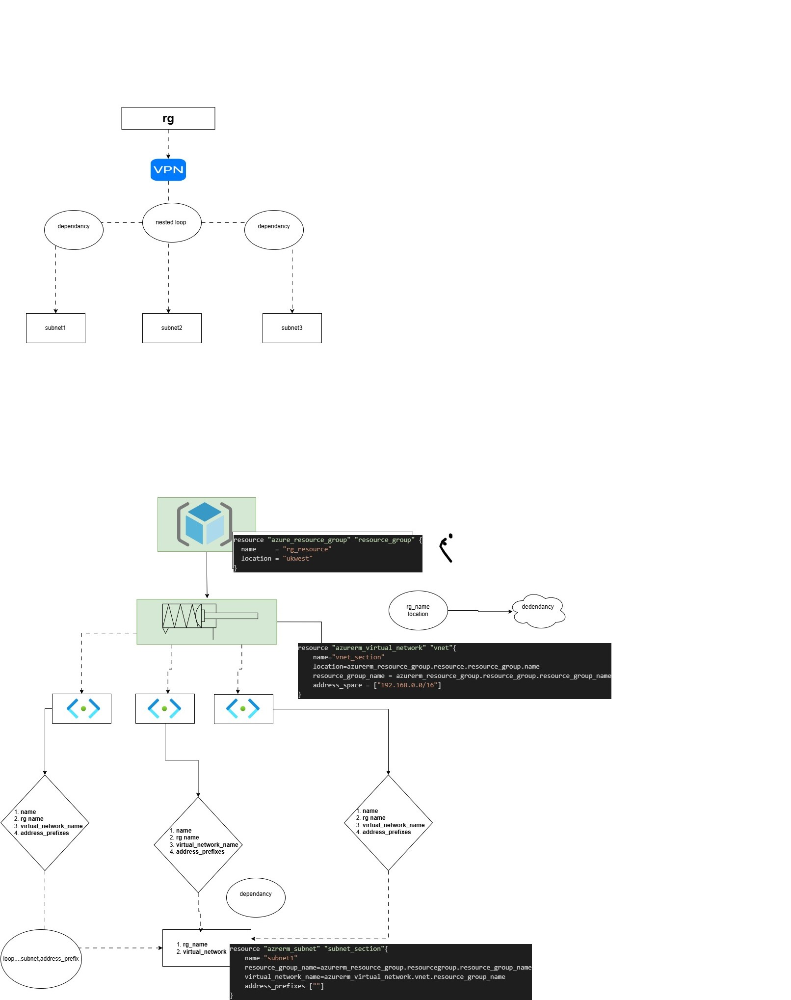

# Azure Networking Infrastructure using Terraform

## Overview

This project provisions Azure networking resources using Terraform. 

### Resources Created

* Azure Resource Group
* Azure Virtual Network
* Multiple Subnets using for_each

## Architecture

## Technologies Used

* Terraform
* Microsoft Azure
* GitHub
* Draw.io

## Terraform Commands

### Initialize

terraform init

### Plan

terraform plan

### Apply

terraform apply

### Destroy

terraform destroy
